# PRUNING AND SPARSITY

## SOURCES REFERED

MIT LECTURES PROVIDED and their lab assignments

## WHAT I KNEW

not all weights are important in a model and a larger model doesnt always mean an accurate model(ANDREW NG).

## BLOG

### DAY0(study)

Watched the lecture 2,3, and 4 by EfficientMl.ai.Understood the root concept of Pruning and why does it work.

And also tried their lab01 assignment.

### DAY 1(write code)

I started to attempt the assignment and realised that most of the thing asked to do were very similar to the lab01 assignment,so most the function that were needed for  the assignment i got it from there.I understood the logic for each and every function that altered/pruned the model.(but ignored the matplotlib tools used)

### DAY 2(Finetuning)

I plotted the paramater distribution and the weight distribution in each layer,to see which layer had highest number of zero values and which layer had highest number of parameters.

i also plotted the sensitvity curves to simulate what effects will pruning have on the accuracy of the model for different pruning rates for different layers (while keeping other layers constants )

My decision for which layer to prune was based on which layer had greatest number of parameters(so pruning will effectively will decrease model size) and how much to prune was based on the sensitivity curve )

#### INITIAL STATE OF THE MODEL

dense model has accuracy=92.95%
dense model has size=35.20 MiB

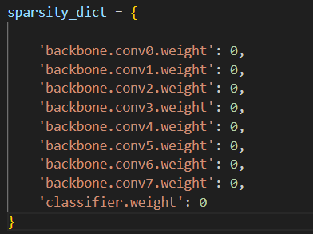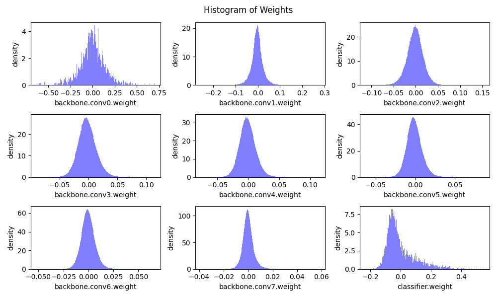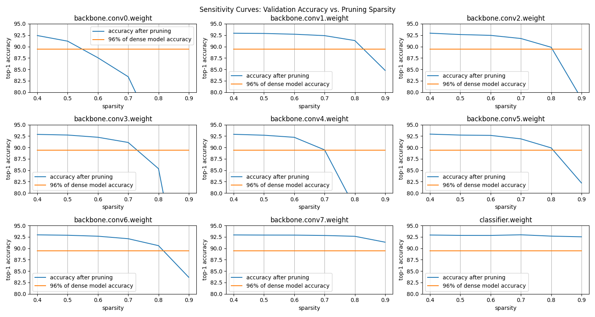

#### RUN1

##### Reason for choice

I only pruned the later layers because their histogram showed steep peaks at 0,indicating they had huge number of near zero valus and sensitivity curve provided the confidence that pruning wont effect the accuracy that much.

reason why i didnt prune the first few layers was the number of parameters were relatively less and pruning them wont yield much benifit.Another thing i considered was that the initial layers of the model are usually associated with basic feature extraction and i was afraid that pruning those will lead to loss of information,hence loss in accuracy as the sensitivity curve doesnt account the effect of pruning on the later layers.

The sparsity of each layer becomes
  backbone.conv0.weight: 0.00
  backbone.conv1.weight: 0.00
  backbone.conv2.weight: 0.00
  backbone.conv3.weight: 0.00
  backbone.conv4.weight: 0.30
  backbone.conv5.weight: 0.60
  backbone.conv6.weight: 0.60
  backbone.conv7.weight: 0.80
  classifier.weight: 0.00

##### RESULTS

Sparse model has size=15.85 MiB = 45.03% of dense model size
Sparse model has accuracy=92.63% before fintuning

dense model has accuracy=92.95%
dense model has size=35.20 MiB

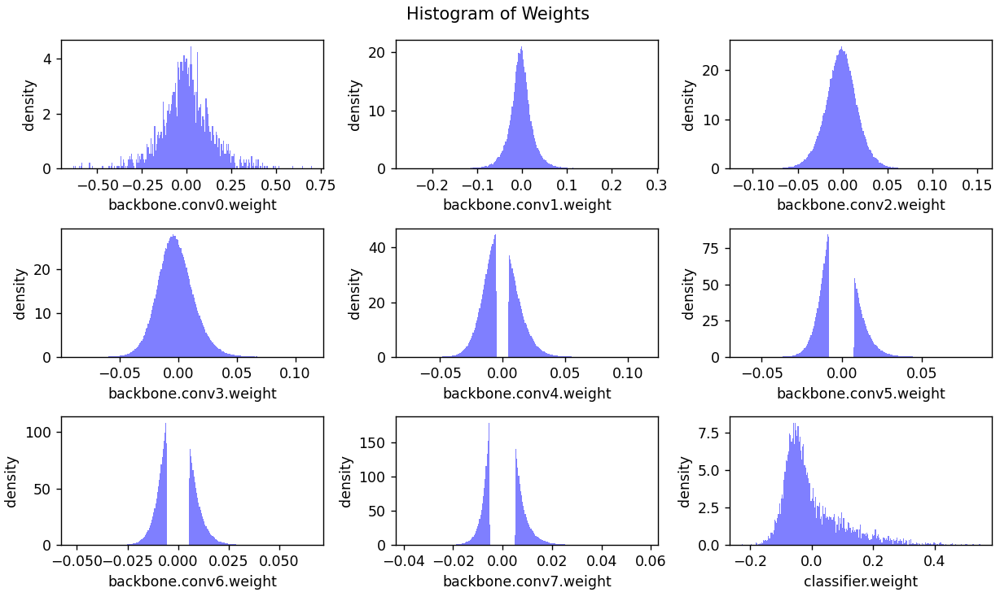

Sparse model has size=15.85 MiB = 45.03% of dense model size
Sparse model has accuracy=92.63% before fintuning
Finetuning Fine-grained Pruned Sparse Model
    Epoch 1 Accuracy 93.06% / Best Accuracy: 93.06%
    Epoch 2 Accuracy 93.02% / Best Accuracy: 93.06%
    Epoch 3 Accuracy 92.95% / Best Accuracy: 93.06%
    Epoch 4 Accuracy 92.85% / Best Accuracy: 93.06%
    Epoch 5 Accuracy 92.83% / Best Accuracy: 93.06%
Sparse model has size=15.85 MiB = 45.03% of dense model size
Sparse model has accuracy=93.06% after fintuning

##### OBSERVATION

The increase in the accuracy(+0.11%) came as mild suprise since I decreased the number of parameters by almost 50%.

#### RUN2

##### What new i did 

since in the last run i had an increase in accuracy i increased the pruning ratio for the later layers and also added pruning ratio to the conv 2 and 3 to just see the effect.

its from this iteration onwards i started to create the senstivity curve after pruning to help me plan my future updates to the sparsity.

The sparsity of each layer becomes
  backbone.conv0.weight: 0.00
  backbone.conv1.weight: 0.00
  backbone.conv2.weight: 0.70
  backbone.conv3.weight: 0.65
  backbone.conv4.weight: 0.60
  backbone.conv5.weight: 0.65
  backbone.conv6.weight: 0.75
  backbone.conv7.weight: 0.90
  classifier.weight: 0.00

##### RESULTS

Sparse model has size=9.55 MiB = 27.14% of dense model size
Sparse model has accuracy=86.62% before fintuning

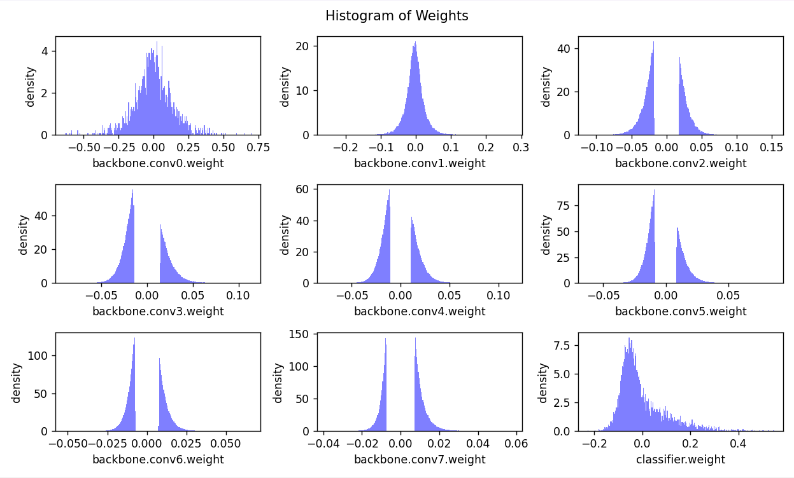

Finetuning Fine-grained Pruned Sparse Model
    Epoch 1 Accuracy 92.76% / Best Accuracy: 92.76%
    Epoch 2 Accuracy 92.75% / Best Accuracy: 92.76%
    Epoch 3 Accuracy 92.80% / Best Accuracy: 92.80%
    Epoch 4 Accuracy 92.76% / Best Accuracy: 92.80%
    Epoch 5 Accuracy 92.77% / Best Accuracy: 92.80%
Sparse model has size=9.55 MiB = 27.14% of dense model size
Sparse model has accuracy=92.80% after fintuning

AFTER FINETUNING

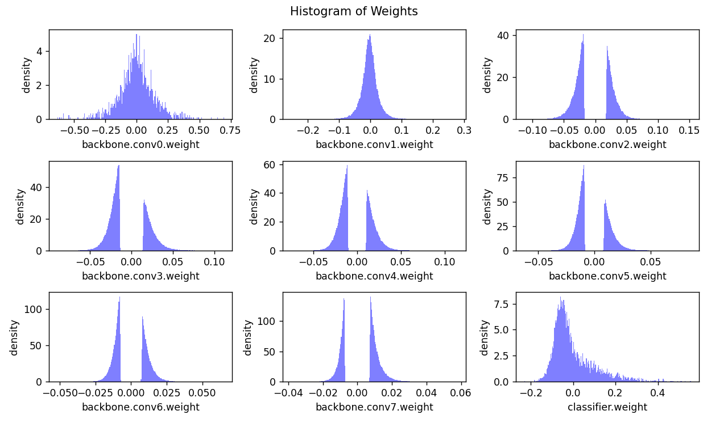

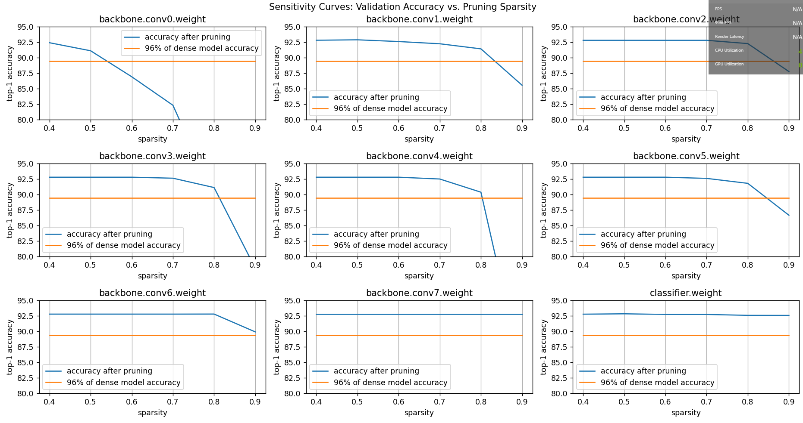

##### OBSERVATION

pruning this time did lead to reduction in accuracy but was it due to pruning of initial weights or due to the reason that i pruned the later layers too much? i looked for the answer in the next RUN.

#### RUN3

##### AIM-

to check my hypothesis that pruning initial layers has a greater neagtive effect on accuracy.

To check that i removed pruning from conv2 layer and kept everything similar and compared the accuracy value from RUN1.

##### RESULT

The sparsity of each layer becomes
  backbone.conv0.weight: 0.00
  backbone.conv1.weight: 0.00
  backbone.conv2.weight: 0.00
  backbone.conv3.weight: 0.65
  backbone.conv4.weight: 0.60
  backbone.conv5.weight: 0.65
  backbone.conv6.weight: 0.75
  backbone.conv7.weight: 0.90
  classifier.weight: 0.00
Sparse model has size=10.34 MiB = 29.37% of dense model size
Sparse model has accuracy=90.48% before fintuning

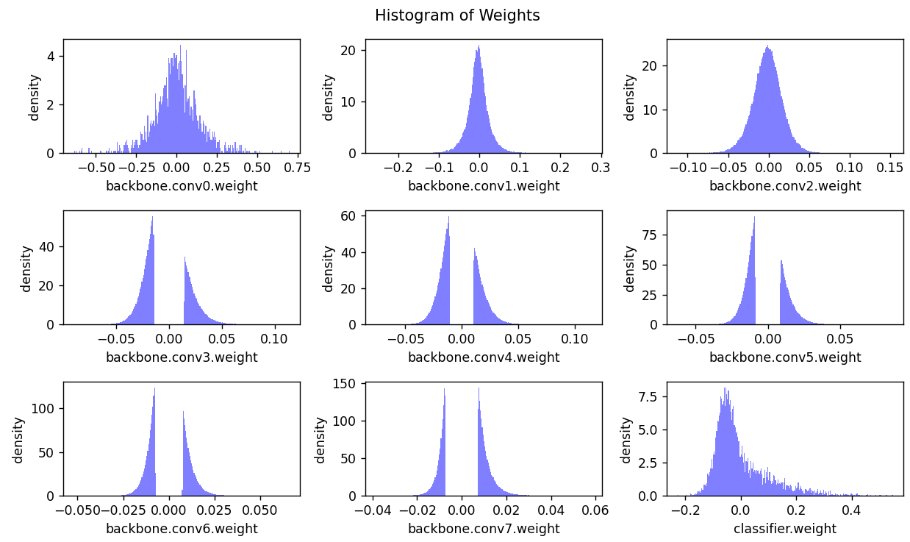

Finetuning Fine-grained Pruned Sparse Model
    Epoch 1 Accuracy 92.79% / Best Accuracy: 92.79%
    Epoch 2 Accuracy 92.84% / Best Accuracy: 92.84%
    Epoch 3 Accuracy 92.80% / Best Accuracy: 92.84%
    Epoch 4 Accuracy 92.79% / Best Accuracy: 92.84%
    Epoch 5 Accuracy 92.84% / Best Accuracy: 92.84%

Sparse model has size=10.34 MiB = 29.37% of dense model size
Sparse model has accuracy=92.84% after fintuning

AFTER FINETUNING

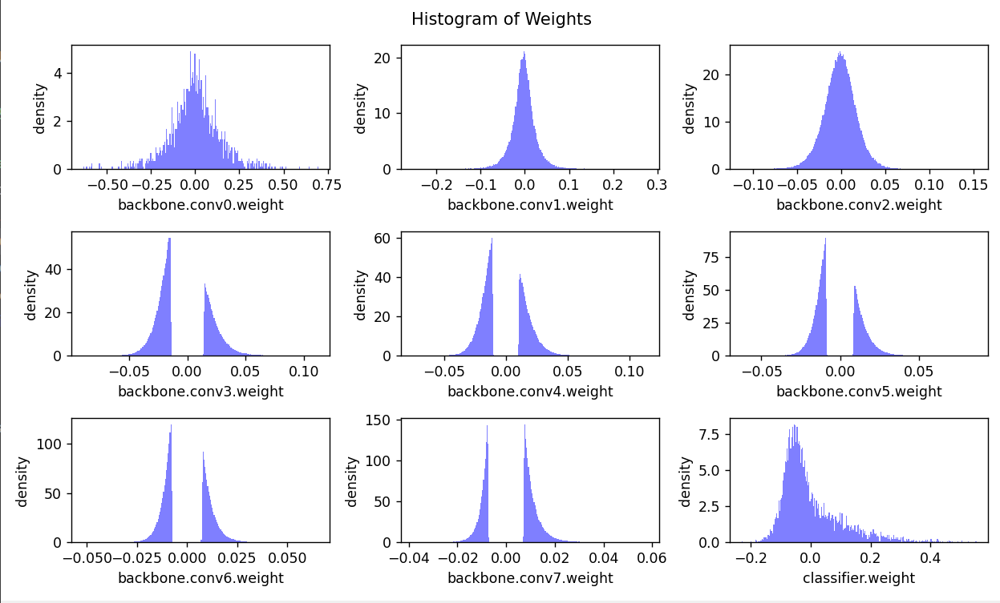

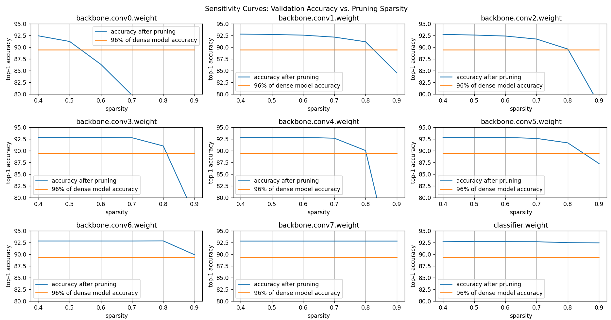

##### OBSERVATION

accuracy increase of just 0.04% from the RUN3 for model size increase 2.13%of original,contradicts my assumption of pruning initial layers will have a drastic effect on accuracy.The increase of 0.04% is probably due to the fact i have removed pruning from the first layer thereby leaving more parameters for the model to work with.

NOTE- There is a possibility that number of epochs that i am considering are less and model might approve on further training but due to lack of computational resources i have considered 5 epochs only.

#### RUN4

##### AIM-

In the later runs i decided to prune my model to maintain a moderate amout of accuracy but focused mainly on reducing the model size.Using the senstivity curve from the previous run i decided the sparsity of the run.

I USED THE FORMULA

[SPARSITY=SPARSITY_PREV+(1-SPARSITY_PREV)*(beta)]

beta=sparsity value from the previous RUN senstivity curve that felt appropriate

example -

{for conv6

sparsity_prev=0.75

beta=0.8

so i will make 

sparsity_conv7=0.75+(0.25*0.8)=0.95

}

The sparsity of each layer becomes
  backbone.conv0.weight: 0.00
  backbone.conv1.weight: 0.00
  backbone.conv2.weight: 0.00
  backbone.conv3.weight: 0.80
  backbone.conv4.weight: 0.91
  backbone.conv5.weight: 0.93
  backbone.conv6.weight: 0.95
  backbone.conv7.weight: 0.95
  classifier.weight: 0.00
Sparse model has size=3.84 MiB = 10.90% of dense model size
Sparse model has accuracy=25.96% before fintuning

Finetuning Fine-grained Pruned Sparse Model
    Epoch 1 Accuracy 91.19% / Best Accuracy: 91.19%
    Epoch 2 Accuracy 91.59% / Best Accuracy: 91.59%
    Epoch 3 Accuracy 91.85% / Best Accuracy: 91.85%
    Epoch 4 Accuracy 91.77% / Best Accuracy: 91.85%
    Epoch 5 Accuracy 91.98% / Best Accuracy: 91.98%
Sparse model has size=3.84 MiB = 10.90% of dense model size
Sparse model has accuracy=91.98% after fintuning

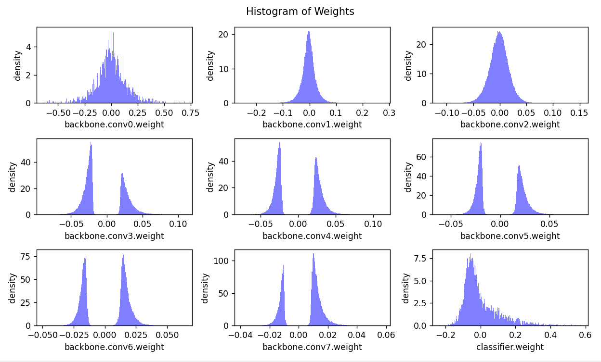

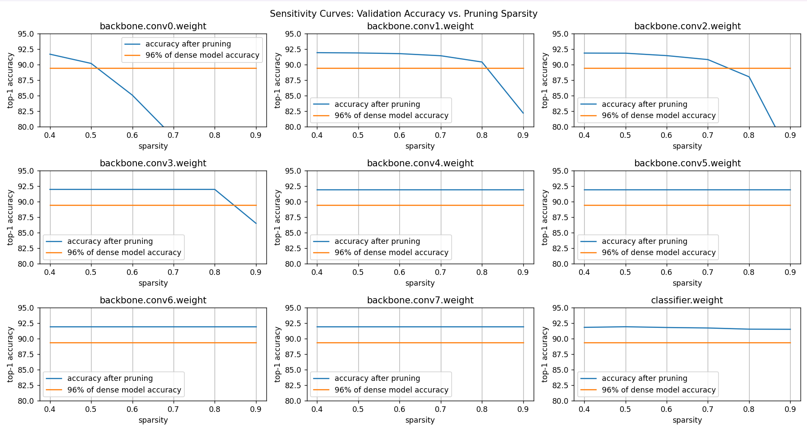

##### OBSERVATION

Steps in Pruning mainly depends on our objective wether we want to focus on reducing the model size or we want to maintain/improve our models accuracy while sufficiently reducing our model size.

#### RUN5

##### What new i did

in all the previous runs i barely touched the conv1 and conv2(except once) layers so this time decided to prune them softly. Out of all the runs this RUNs this will have highest amount of sparsing,so i took this oppurtunity to observe the effect of epochs on pruning.

##### RESULTS

The sparsity of each layer becomes
  backbone.conv0.weight: 0.00
  backbone.conv1.weight: 0.50
  backbone.conv2.weight: 0.55
  backbone.conv3.weight: 0.80
  backbone.conv4.weight: 0.91
  backbone.conv5.weight: 0.93
  backbone.conv6.weight: 0.95
  backbone.conv7.weight: 0.95
  classifier.weight: 0.00
Sparse model has size=3.08 MiB = 8.75% of dense model size
Sparse model has accuracy=24.36% before fintuning

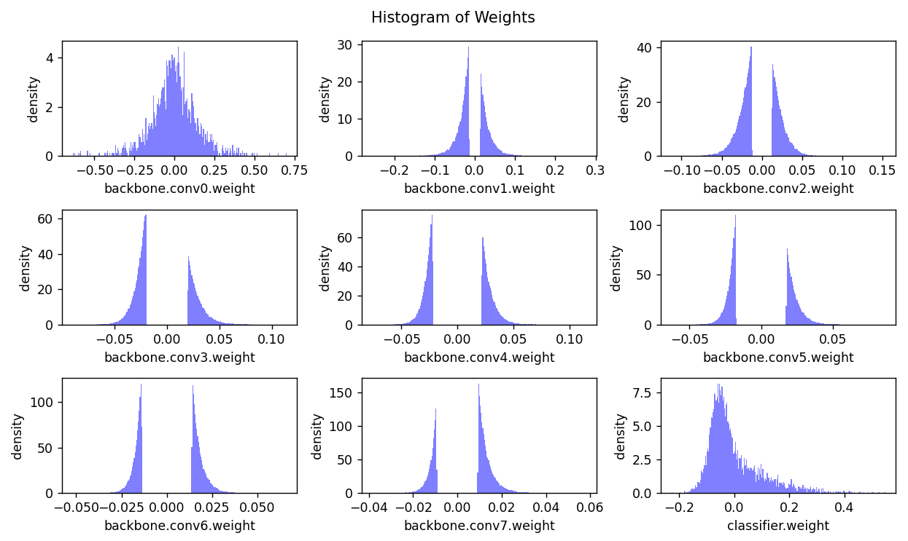

Finetuning Fine-grained Pruned Sparse Model
    Epoch 1 Accuracy 91.14% / Best Accuracy: 91.14%
    Epoch 2 Accuracy 91.54% / Best Accuracy: 91.54%
    Epoch 3 Accuracy 91.80% / Best Accuracy: 91.80%
    Epoch 4 Accuracy 91.78% / Best Accuracy: 91.80%
    Epoch 5 Accuracy 91.86% / Best Accuracy: 91.86%
    Epoch 6 Accuracy 92.08% / Best Accuracy: 92.08%
    Epoch 7 Accuracy 91.99% / Best Accuracy: 92.08%
    Epoch 8 Accuracy 91.91% / Best Accuracy: 92.08%
    Epoch 9 Accuracy 92.16% / Best Accuracy: 92.16%
Sparse model has size=3.08 MiB = 8.75% of dense model size
Sparse model has accuracy=92.16% after fintuning

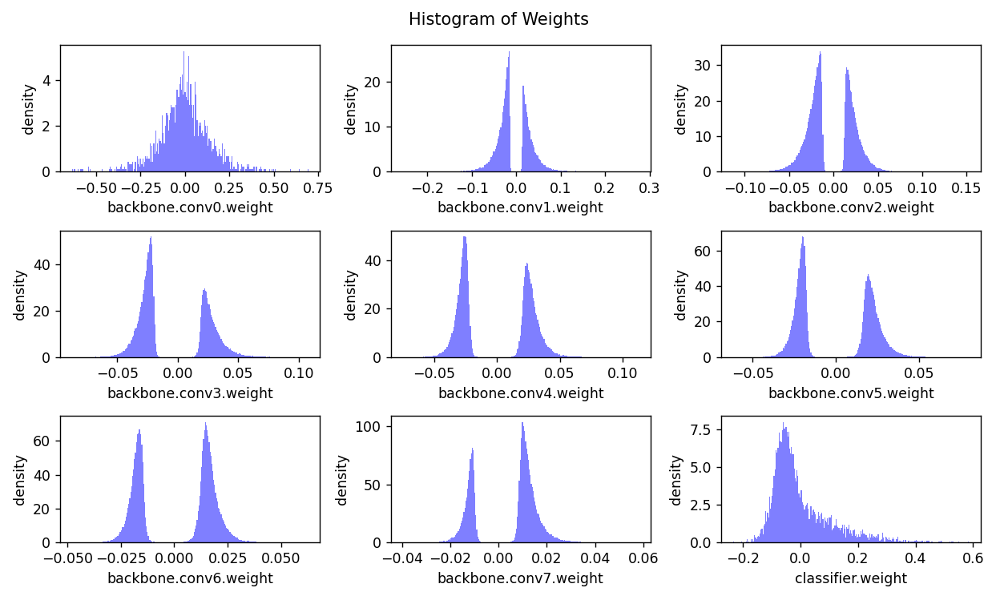

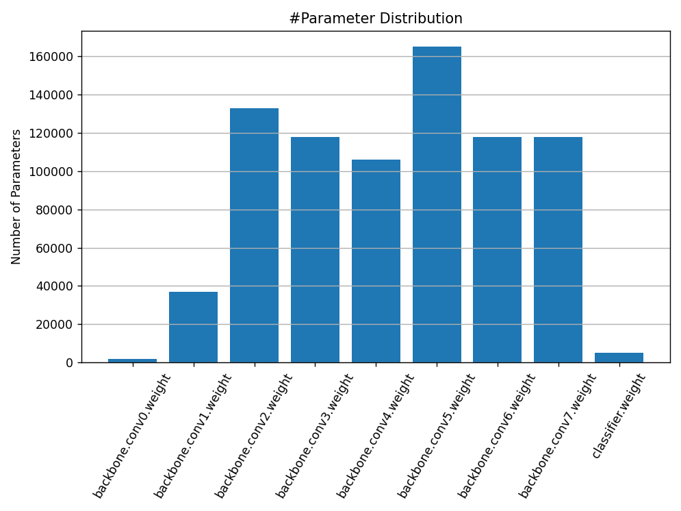

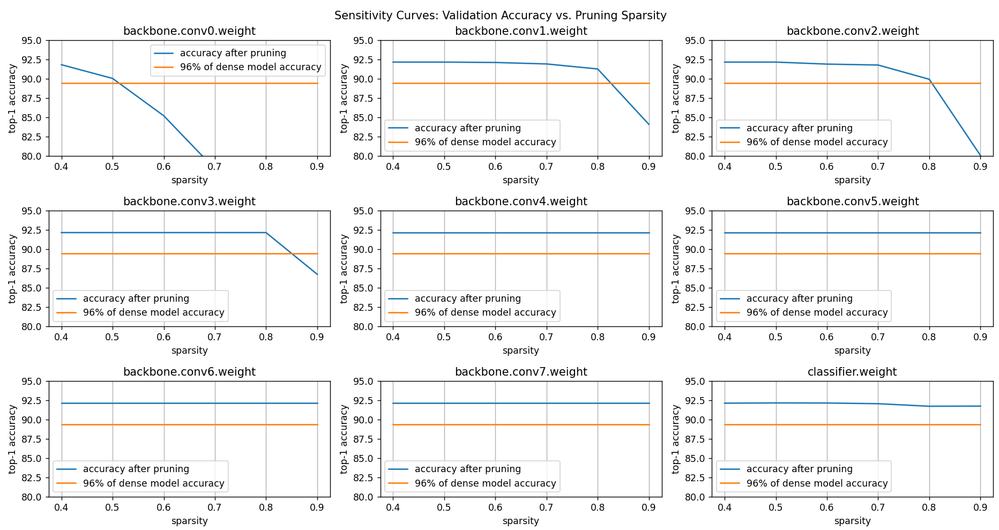

##### Observation

by observing the improving accuracy with epochs we can say For a larger sparsity it is important to train the model for larger number of epochs because the parameters of the model require a significant update.

## NOTE FOR EVALUATOR

Thanks for reading through
